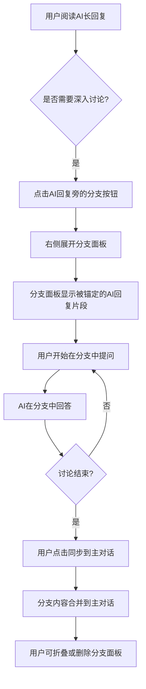

# 锚定式分支对话AI聊天产品 - 产品需求文档

## 1. 产品概述

**AnchorChat** 是一款支持锚定式分支对话的AI聊天产品，通过创新的交互设计解决现有AI聊天产品在处理长回复细节讨论时的痛点。用户可以像Word批注一样，将细节讨论精准锚定在AI回复的特定位置，展开分支对话后可以顺畅回归主对话，保持主对话主线的清晰性。

- **核心价值**：解决AI聊天产品中"针对AI长回复部分追问导致主对话发散跑偏"的问题
- **目标用户**：需要与AI进行深度技术讨论、文档编写、代码审查等专业场景的用户
- **产品定位**：轻量化网页版Demo，支持Silicon Flow API

## 2. 核心功能

### 2.1 用户角色

| 角色 | 认证方式 | 核心权限 |
|------|----------|----------|
| 普通用户 | API密钥配置 | 使用AI对话、分支讨论、配置管理 |

### 2.2 功能模块

1. **主聊天界面**：承载用户与AI的主要对话流程
2. **分支锚定系统**：将分支对话精准绑定到AI回复片段
3. **分支面板**：独立的分支讨论区域，支持展开/收拢
4. **API配置模块**：Silicon Flow API密钥的配置与管理

### 2.3 页面详情

| 页面名称 | 模块名称 | 功能描述 |
|----------|----------|----------|
| 主界面 | 左侧对话历史栏 | 显示历史对话列表，支持创建新对话、切换对话 |
| 主界面 | 中间主聊天区 | 用户与AI对话的主区域，显示消息列表 |
| 主界面 | AI回复操作栏 | 每个AI回复下方显示分支按钮，点击可创建锚定分支 |
| 主界面 | 锚定分支面板 | 展开在AI回复右侧，承载分支对话内容 |

## 3. 核心交互流程

### 3.1 分支对话创建流程



### 3.2 分支同步机制

1. 用户在分支中完成的讨论内容可手动同步到主对话
2. 同步后，主对话AI会自动获得分支上下文的摘要信息
3. 用户可继续在主对话中基于同步内容进行追问

## 4. 用户界面设计

### 4.1 设计风格

- **整体风格**：清爽的浅色系风格，现代简约设计
- **配色方案**：
  - 主色：#4F46E5 (靛蓝色)
  - 辅助色：#10B981 (翠绿色，用于分支标识)
  - 背景色：#F8FAFC (浅灰白)
  - 卡片背景：#FFFFFF (纯白)
  - 文字色：#1E293B (深灰蓝)
  - 次要文字：#64748B (中灰)
- **按钮样式**：圆角按钮，hover时有轻微阴影和颜色变化
- **字体**：使用Inter作为主字体，Mono作为代码字体
- **布局**：三栏布局 - 左侧边栏(240px) + 主聊天区(弹性) + 右侧分支面板(360px，可折叠)

### 4.2 页面设计

#### 主界面布局

```
┌─────────────────────────────────────────────────────────────────┐
│  Header: Logo + API配置按钮                                      │
├──────────┬────────────────────────────────┬─────────────────────┤
│          │                                │                     │
│ 对话历史 │      主聊天区域                  │    锚定分支面板      │
│  列表    │                                │   (可折叠展开)        │
│          │   ┌─────────────────────┐      │                     │
│ • 对话1  │   │ AI回复内容           │      │  [锚定的AI片段]      │
│ • 对话2  │   │ [分支按钮] [引用]    │      │  ┌───────────────┐  │
│          │   └─────────────────────┘      │  │ 分支对话内容    │  │
│          │                                │  │ ...            │  │
│          │                                │  └───────────────┘  │
│          │                                │                     │
│ [+新对话] │                                │  [同步] [折叠] [删除]│
│          │                                │                     │
└──────────┴────────────────────────────────┴─────────────────────┘
```

#### 分支面板样式

- 背景色带左侧4px的翠绿色边框，表示这是分支区域
- 顶部显示被锚定的AI回复片段（带引用样式）
- 下方是分支内的对话内容
- 底部操作栏：同步按钮、折叠按钮、删除按钮

### 4.3 响应式设计

- **桌面优先**（最小宽度1024px）：三栏布局完整展示
- **平板适配**（768px-1024px）：分支面板以overlay方式展示
- **移动端**（<768px）：单栏布局，分支以全屏模态框展示

### 4.4 交互动效

- 消息发送：fadeIn + slideUp 动画
- 分支面板展开：slideIn 从右侧滑入
- 按钮hover：scale(1.02) + 阴影加深
- 消息加载：typing indicator 脉动动画

## 5. 功能详细规格

### 5.1 API配置

- 用户点击配置按钮弹出模态框
- 输入框用于填写Silicon Flow API密钥
- 保存后密钥存储在localStorage
- 带有密钥显示/隐藏切换功能
- 提供连接测试功能

### 5.2 主聊天功能

- 支持Markdown渲染
- 代码块语法高亮
- 消息时间戳显示
- 打字机效果显示AI回复

### 5.3 分支锚定功能

- **创建分支**：点击AI回复右侧的分支图标按钮
- **锚定片段**：用户可选中AI回复中的特定文字作为锚定片段
- **分支面板**：右侧展开，显示锚定片段和分支对话
- **上下文同步**：分支上下文自动同步给主对话AI（用户无感知）

### 5.4 分支操作

- **手动同步**：用户主动点击同步按钮，将分支讨论精华同步到主对话
- **折叠/展开**：分支面板可折叠收拢
- **删除分支**：删除分支及其所有内容
- **返回主对话**：关闭分支面板，继续主对话流程

## 6. 非功能需求

### 6.1 性能需求

- 页面首次加载 < 2秒
- 消息发送响应 < 3秒（API延迟除外）
- 分支面板展开 < 300ms

### 6.2 数据存储

- 对话历史存储在localStorage
- API密钥存储在localStorage（加密处理）
- 支持导出对话记录

### 6.3 兼容性

- 支持Chrome、Firefox、Safari、Edge最新两个版本
- 移动端优先不支持（桌面端体验优先）

## 7. 成功标准

1. ✅ 用户可以配置Silicon Flow API密钥并成功调用AI
2. ✅ 用户可以在主对话中与AI进行正常对话
3. ✅ 用户可以针对AI回复创建锚定分支
4. ✅ 分支对话内容可以手动同步回主对话
5. ✅ 分支面板可以折叠、删除
6. ✅ 整体界面风格清爽、交互流畅
