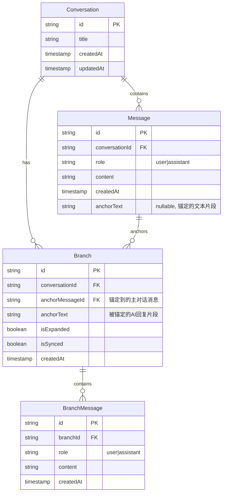

# AnchorChat 技术架构文档

## 1. 架构设计

```
┌─────────────────────────────────────────────────────────────────┐
│                        前端应用层 (React)                        │
├─────────────────────────────────────────────────────────────────┤
│  ┌─────────────┐  ┌─────────────┐  ┌─────────────────────────┐ │
│  │   侧边栏组件  │  │  主聊天组件  │  │     分支面板组件        │ │
│  │  Sidebar    │  │ ChatArea    │  │   BranchPanel          │ │
│  └─────────────┘  └─────────────┘  └─────────────────────────┘ │
├─────────────────────────────────────────────────────────────────┤
│                        状态管理层 (React Context)                │
│  ┌─────────────┐  ┌─────────────┐  ┌─────────────────────────┐ │
│  │ 对话状态    │  │ 分支状态    │  │     配置状态            │ │
│  │ Conversation│  │ BranchStore│  │     ConfigStore        │ │
│  └─────────────┘  └─────────────┘  └─────────────────────────┘ │
├─────────────────────────────────────────────────────────────────┤
│                        服务层                                    │
│  ┌─────────────────────────┐  ┌─────────────────────────────┐ │
│  │   API服务 (SiliconFlow)  │  │    本地存储服务             │ │
│  │   apiService.ts          │  │    storageService.ts       │ │
│  └─────────────────────────┘  └─────────────────────────────┘ │
├─────────────────────────────────────────────────────────────────┤
│                        数据层 (localStorage)                     │
│  conversations | branches | config | apiKeys                   │
└─────────────────────────────────────────────────────────────────┘
```

## 2. 技术选型

- **前端框架**：React@18 + TypeScript
- **构建工具**：Vite
- **样式方案**：Tailwind CSS
- **Markdown渲染**：react-markdown + remark-gfm
- **代码高亮**：Prism.js / highlight.js
- **图标库**：Lucide React
- **状态管理**：React Context API（轻量化方案）
- **数据存储**：localStorage

## 3. 路由定义

| 路由 | 用途 | 组件 |
|------|------|------|
| / | 主界面 | App.tsx |
| /settings | API配置 | SettingsModal |

由于是单页应用，路由采用简单的状态切换方式，不使用React Router。

## 4. API定义

### 4.1 Silicon Flow API 集成

**请求端点**：`https://api.siliconflow.cn/v1/chat/completions`

**请求格式**：
```typescript
interface ChatRequest {
  model: string;           // 模型名称，如 "deepseek-ai/DeepSeek-V3"
  messages: Message[];      // 对话消息数组
  stream?: boolean;         // 是否启用流式响应
}

interface Message {
  role: 'user' | 'assistant' | 'system';
  content: string;
}
```

**响应格式**：
```typescript
interface ChatResponse {
  id: string;
  model: string;
  choices: {
    index: number;
    message: {
      role: 'assistant';
      content: string;
    };
    finish_reason: string;
  }[];
  usage: {
    prompt_tokens: number;
    completion_tokens: number;
    total_tokens: number;
  };
}
```

### 4.2 分支上下文同步

分支对话完成后，通过在主对话消息中添加系统级上下文说明实现同步：

```
[系统提示] 用户在之前的分支讨论中就以下内容进行了深入探讨：{branch_summary}
这些讨论结论已同步到当前对话中。
```

## 5. 数据模型

### 5.1 数据模型定义



### 5.2 数据存储结构

```typescript
// localStorage keys
const STORAGE_KEYS = {
  CONVERSATIONS: 'anchorchat_conversations',
  BRANCHES: 'anchorchat_branches',
  BRANCH_MESSAGES: 'anchorchat_branch_messages',
  API_CONFIG: 'anchorchat_api_config',
  CURRENT_CONVERSATION: 'anchorchat_current_conversation',
};

// 数据结构
interface StoredConversation {
  id: string;
  title: string;
  messages: StoredMessage[];
  createdAt: number;
  updatedAt: number;
}

interface StoredBranch {
  id: string;
  messageId: string;       // 锚定的消息ID
  anchorText: string;       // 锚定的文本
  messages: StoredMessage[];
  isExpanded: boolean;
  isSynced: boolean;
  createdAt: number;
}

interface APIConfig {
  apiKey: string;          // 加密存储
  model: string;
  baseUrl: string;
}
```

## 6. 组件架构

```
App
├── Header
│   ├── Logo
│   └── SettingsButton
├── Sidebar
│   ├── ConversationList
│   │   ├── ConversationItem (可折叠)
│   │   └── ...
│   └── NewConversationButton
├── MainContent
│   ├── ChatArea
│   │   ├── MessageList
│   │   │   ├── Message
│   │   │   │   ├── MessageContent (Markdown渲染)
│   │   │   │   └── MessageActions (复制/分支按钮)
│   │   │   └── ...
│   │   ├── TypingIndicator
│   │   └── ChatInput
│   └── BranchPanel (条件渲染)
│       ├── BranchHeader (显示锚定片段)
│       ├── BranchMessageList
│       │   └── BranchMessage
│       └── BranchActions (同步/折叠/删除)
└── Modals
    └── SettingsModal
        ├── APIKeyInput
        └── ModelSelector
```

## 7. 核心模块设计

### 7.1 对话状态管理 (ConversationContext)

```typescript
interface ConversationState {
  conversations: StoredConversation[];
  currentConversation: StoredConversation | null;
  branches: Map<string, StoredBranch>;  // messageId -> Branch
  activeBranchId: string | null;

  // Actions
  createConversation: () => void;
  selectConversation: (id: string) => void;
  deleteConversation: (id: string) => void;
  sendMessage: (content: string) => Promise<void>;
  createBranch: (messageId: string, anchorText: string) => void;
  toggleBranch: (messageId: string) => void;
  syncBranch: (branchId: string) => void;
  deleteBranch: (branchId: string) => void;
}
```

### 7.2 API服务 (apiService)

```typescript
class APIService {
  private config: APIConfig;

  constructor(config: APIConfig);

  async sendMessage(
    messages: Message[],
    onChunk?: (chunk: string) => void
  ): Promise<string>;

  async testConnection(): Promise<boolean>;
}
```

### 7.3 存储服务 (storageService)

```typescript
class StorageService {
  saveConversations(conversations: StoredConversation[]): void;
  loadConversations(): StoredConversation[];
  saveBranches(branches: StoredBranch[]): void;
  loadBranches(): StoredBranch[];
  saveConfig(config: APIConfig): void;
  loadConfig(): APIConfig | null;
}
```

## 8. 关键交互实现

### 8.1 分支创建流程

1. 用户点击AI消息右侧的分支图标
2. 弹出文本选择器，用户可选择特定文本作为锚定片段
3. 创建Branch对象，关联到目标Message
4. 右侧分支面板展开，显示锚定片段
5. 分支状态保存到localStorage

### 8.2 分支同步流程

1. 用户在分支中完成讨论
2. 点击"同步到主对话"按钮
3. 系统生成分支内容摘要
4. 在主对话消息列表末尾添加系统级同步消息
5. 分支标记为已同步状态

### 8.3 打字机效果实现

```typescript
async function streamMessage(
  response: Response,
  onChunk: (char: string) => void
) {
  const reader = response.body?.getReader();
  const decoder = new TextDecoder();

  while (reader) {
    const { done, value } = await reader.read();
    if (done) break;

    const chunk = decoder.decode(value);
    // 解析SSE数据并逐字输出
    onChunk(chunk);
  }
}
```

## 9. 项目结构

```
anchorchat/
├── index.html
├── package.json
├── vite.config.ts
├── tailwind.config.js
├── src/
│   ├── main.tsx
│   ├── App.tsx
│   ├── index.css
│   ├── types/
│   │   └── index.ts
│   ├── contexts/
│   │   ├── ConversationContext.tsx
│   │   └── ConfigContext.tsx
│   ├── components/
│   │   ├── Header.tsx
│   │   ├── Sidebar.tsx
│   │   ├── ChatArea.tsx
│   │   ├── Message.tsx
│   │   ├── MessageInput.tsx
│   │   ├── BranchPanel.tsx
│   │   ├── BranchMessage.tsx
│   │   └── SettingsModal.tsx
│   ├── services/
│   │   ├── apiService.ts
│   │   └── storageService.ts
│   └── utils/
│       └── helpers.ts
└── README.md
```

## 10. 安全考虑

- API密钥使用Base64简单编码后存储（实际生产应使用更安全的加密方式）
- 不在代码中硬编码任何密钥
- 提供密钥清除功能
- 敏感操作前进行确认提示
